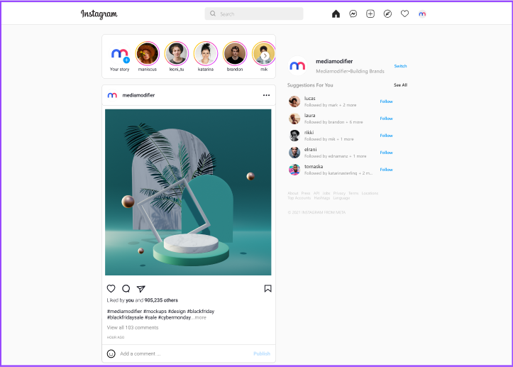
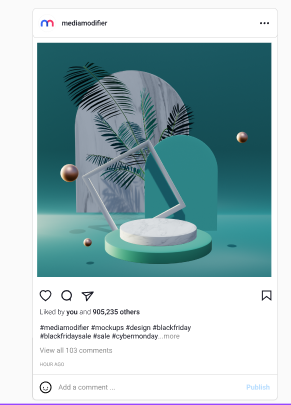
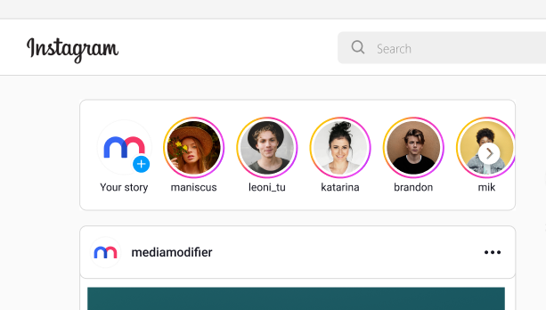

# TechBridge Instagram Clone Project


## Table of Contents

- [About the Project](#about-the-project)
- [Features](#features)
- [Technologies Used](#technologies-used)
- [Installation](#installation)
- [Usage](#usage)
- [Screenshots](#screenshots)
- [Contributors](#contributors)
- [License](#license)

---

## About the Project

This repository contains the frontend capstone project for the **Techbridge Program**. The project is a clone of Instagram's **post and profile pages**, built with **React**, **JavaScript**, and **CSS**. 

The goal of this project was to learn and apply frontend development skills by creating a functional social media clone. 

### Key Objectives:
- Build responsive and interactive user interfaces.
- Gain hands-on experience with React.
- Enhance collaborative development skills in a team setting.

---

## Features

- **User Profile Pages:** Display user details, posts, and activity.
- **Post Feed:** Interactive post view with options for likes and comments.
- **Responsive Design:** Fully optimized for desktop and mobile screens.
- **Dynamic Data Rendering:** Integration with APIs to populate user data and posts dynamically.

---

## Technologies Used

- **React**: For building reusable components and managing application state.
- **JavaScript (ES6+)**: Core language for dynamic functionality.
- **CSS**: Styling and layout design.
- **API Integration**: For dynamic and real-time content updates.

---

## Installation

1. Clone the repository:

   ```bash
   git clone https://github.com/yourusername/instagram-clone.git
   ```

2. Navigate to the project directory:

   ```bash
   cd instagram-clone
   ```

3. Install dependencies:

   ```bash
   npm install
   ```

4. Start the development server:

   ```bash
   npm start
   ```

---

## Usage

- Navigate to the application in your web browser (usually [http://localhost:3000](http://localhost:3000)).
- Interact with the post feed and profile pages.

---

## Screenshots

### Post Feed Page
 <!-- Replace with an actual screenshot -->

### User Story Page
 <!-- Replace with an actual screenshot -->

---

## Contributors

This project was developed collaboratively by a team of contributors specializing in various aspects of frontend development.

### Lead Developer:
**Oyetunji Fatai Olasunkanmi**  
- GitHub: [ola-oye](https://github.com/ola-oye)  
- LinkedIn: [Olasunkanmi Oyetunji](https://www.linkedin.com/in/olasunkanmi-oyetunji-4a38991b0/)

### Additional Contributors:

**Andrew Onoriode Ayemo**  
- GitHub: [andrewgold](https://github.com/yourusername)  
- LinkedIn: [Andrew Ayemo](https://www.linkedin.com/in/andrew-gold-50948

**Eze-Oge Samuella**  
- Github: [samuella-code](https://github.com/samuella-code) 
- LinkedIn [Eze-Oge Samuella](https://www.linkedin.com/in/samuella-eze-oge/)

**Idowu shukurat opeyemi **  
- GitHub: [shukroh 890](https://github.com/shukroh-890)  
- LinkedIn: [ shukroh Idowu ](https://www.linkedin.com/in/shukroh-idowu-22356731b)

**Olawale Emmanuel Yakubu**  
- GitHub: [Panucci-Juggernaut](https://github.com/Panucci-Juggernaut)  
- LinkedIn: [yakubu-olawale]( http://linkedin.com/in/yakubu-olawale-a0bb19247)

**Olawale Kafayat Ayomide**  
- GitHub: [slimzykaffy](https://github.com/slimzykaffy)  
- LinkedIn: [Kafayat Olawale](https://www.linkedin.com/in/kafayat-olawale-8b005425)

**Ogunkanmi Oluwapelumi grace **  
- GitHub: [Grace-niks]https://github.com/Grace-niks)  
- LinkedIn: [Andrew Ayemo](https://www.linkedin.com/in/adenike-grace-33b97221)

**Ogunsola Samson **  
- GitHub: [Folarvic](https://github.com/Folarvic)  
- LinkedIn: [ogunsola-samson](LinkedIn https://ng.linkedin.com/in/ogunsola-samson-aa75371b5)


---
